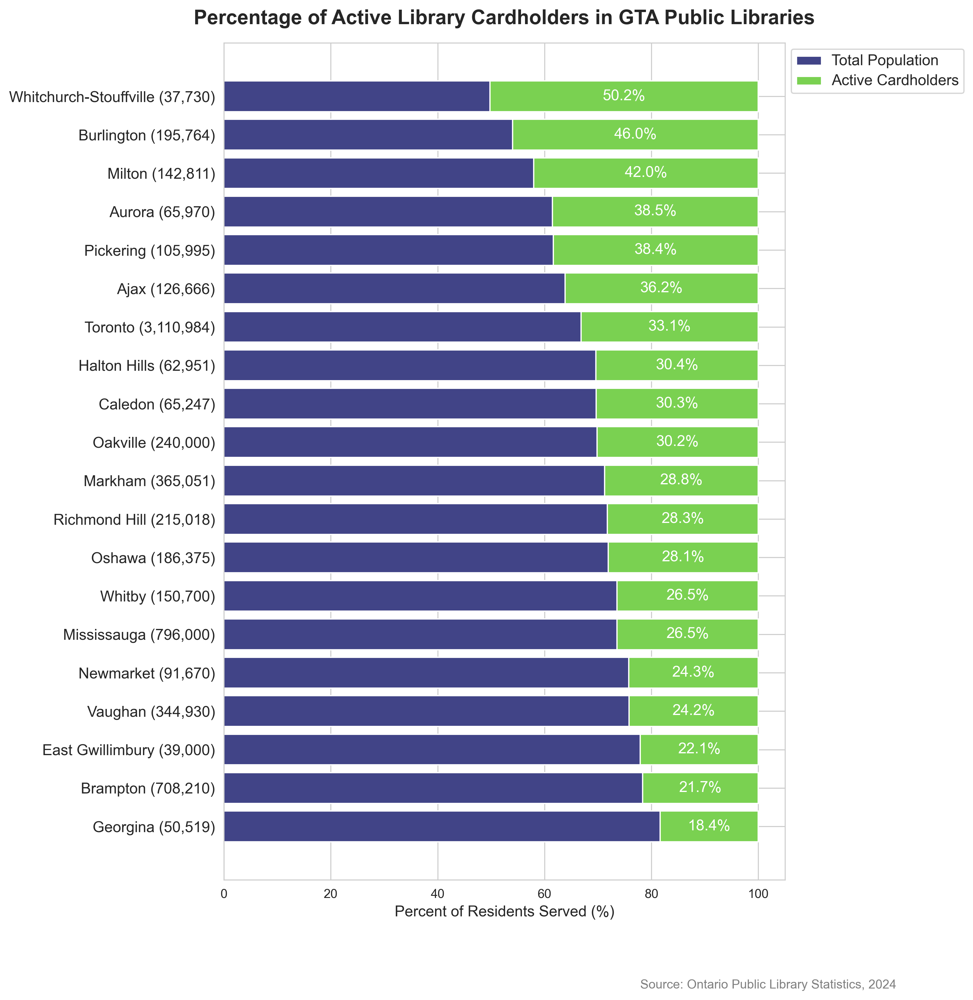

## Description

The figure shows the percentage of active cardholders per library systems in GTA cities. This is done through stacked horizontal bars for each of the libraries.
The bottom (purple/blue) colour represents the total population, and the stacked (green) bar represents the percentage of active cardholders. 
The total resident population is summarized next to the name of each library system.
It is noticeable that the library system of Whitchurch-Stouffville (37,730) has the highest percentage of active cardholders. Followed by Burlington and Milton.
The cities with the lowest percentage are Brampton followed by Georgina (18.1%), that has the lowest out of all cities.  

 - Descriptive statistics (eg. mean), outliers, max and min points, correlations, comparing points
3 - Complex trends, pattern synthesis, clusters, exceptions, common 

## Figure 

