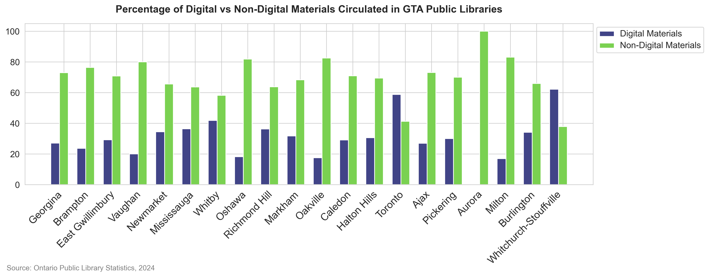

## Description

The figure compares the type of all materials circulated captured as percentages for the library systems in the GTA area. 
This is done through side by side vertical bar plots, where the blue/purple bars represent the percentage of digital materials out of all materials circulated, and green
represents how many of these were non-digital. 
Whitchurch-Stouffville shows one of the few instances were most material circulated is in the form of digital materials. This was also the case in Toronto. Another finding from the figure
is that Aurora reported that all circulated materials in 2024 were non-digital. The common pattern was that most of the materials circulated were non-digital. 
## Figure 

